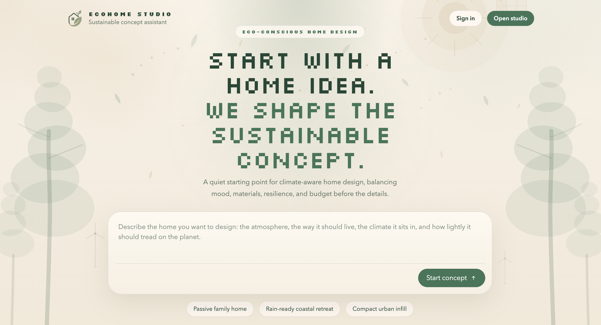
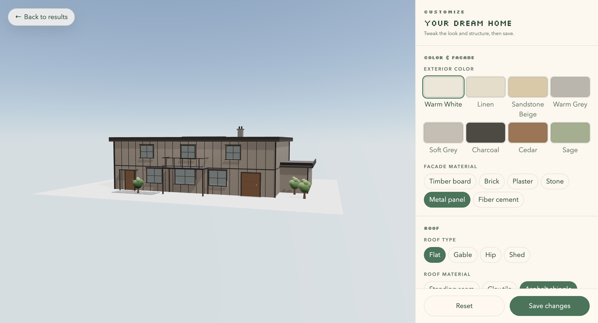
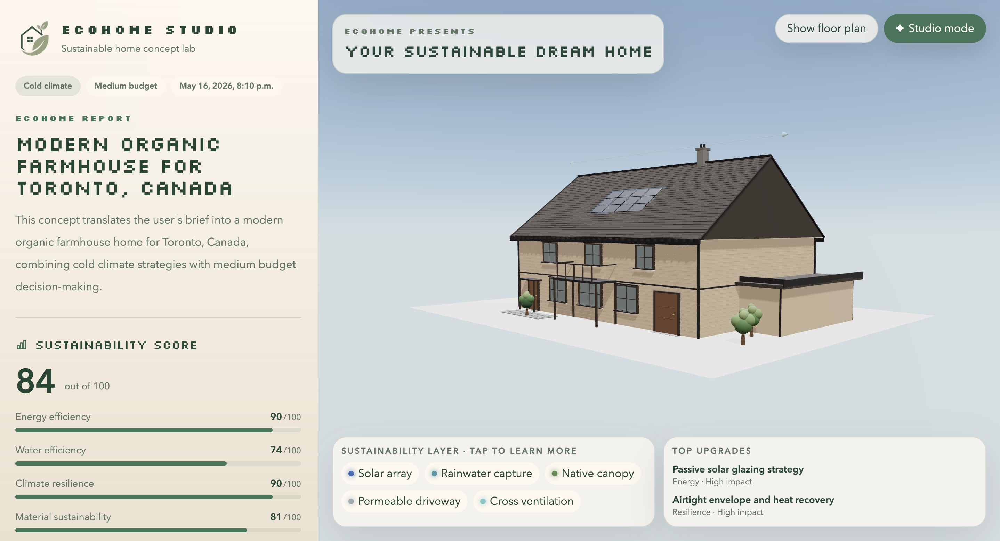

<br/><div align="center">

# 🌿 EcoHome Studio

**Turn your dream home brief into a fully realized, sustainability-scored concept — in seconds.**

EcoHome Studio combines AI-powered design generation, retrieval-augmented sustainability guidance, and an interactive real-time 3D preview into a single, beautifully crafted experience. Describe your vision, upload inspiration images, and walk away with an architect-quality concept tailored to your climate, budget, and values.

[](https://nextjs.org/)
[](https://www.typescriptlang.org/)
[](https://threejs.org/)
[](https://tailwindcss.com/)
[](https://vitest.dev/)

</div>

---

## 🖼️ Take a Tour

<div align="center">

| Homescreen | Studio | Results |
|---|---|---|
|  |  |  |
| *Write your brief.* | *Refine the concept.* | *Explore the report + 3D model.* |

</div>

---

## ✨ What EcoHome Studio Does

EcoHome Studio is an end-to-end AI home design platform that takes a plain-language brief and produces a complete, structured home concept including:

- 🏠 **Architectural style and massing** — body shape, roof type, facade materials, and dormer details
- 🌱 **Sustainability scoring** — energy efficiency, water use, climate resilience, embodied carbon, and affordability rated 0–100
- 📐 **Interactive 3D preview** — a real-time, orbit-able 3D model with per-feature overlays (solar panels, green roof, rainwater harvesting, native trees, cross-ventilation, permeable driveway)
- 🗺️ **2D floor plan** — room-by-room layout with type-coded colour blocks
- 💡 **Upgrade recommendations** — actionable, impact-rated improvements grounded in real sustainability guidance
- 🎨 **Inspiration-aware generation** — upload mood board images and the platform extracts palette, materials, and aesthetic cues to steer the output
- ✦ **Studio Mode** — full-screen editor for fine-tuning the generated home after the fact: swap colors and materials, change roof or body shape, toggle sustainability features, adjust floors and structural details, then save. The sustainability score, environmental impact percentages, climate narrative, and 2D floor plan all re-derive from the edits.

---

## 🚀 Product Flow

```
Brief → Studio → AI Generation → Results → 3D Preview → Studio Mode (edit & save)
```

1. **Land** — write your dream home brief on the homepage
2. **Studio** — refine the brief, upload inspiration images, set location, climate, and budget
3. **Analyze** — pixel-level image analysis extracts your palette, material preferences, and aesthetic direction
4. **Generate** — a structured concept is produced through an AI pipeline grounded in curated sustainability guidance
5. **Explore** — browse the full concept report and orbit the interactive 3D model of your home
6. **Customize** — open Studio Mode to dial in materials, roof, floors, or sustainability features; saved edits re-score the concept and refresh the report

> Try the live demo instantly at `/results/demo` — no brief required.

---

## 🏗️ Tech Stack

### 🖥️ App & UI
| Technology | Purpose |
|---|---|
| Next.js 15 (App Router) | Full-stack framework, SSR, routing |
| React 19 | UI component model |
| TypeScript | End-to-end type safety |
| Tailwind CSS v4 | Utility-first styling |

### 🤖 AI & Retrieval
| Technology | Purpose |
|---|---|
| Featherless.ai | Structured JSON home-concept generation via OpenAI-compatible API |
| LangChain | RAG ingestion pipeline and vector-store integration |
| Supabase pgvector | Primary semantic retrieval for sustainability guidance |
| watsonx.ai | Secondary vector-index fallback |
| Local seed docs | Tertiary fallback — always available, no network required |
| `sharp` | Pixel-level inspiration image analysis |

### 🎨 3D & Visual
| Technology | Purpose |
|---|---|
| Three.js | 3D scene geometry |
| `@react-three/fiber` | React renderer for Three.js |
| `@react-three/drei` | Camera, controls, and helpers |
| SVG | 2D floor plan rendering |

### 🧪 Validation & Testing
| Technology | Purpose |
|---|---|
| Zod | Request and schema validation |
| Vitest | Unit and integration test runner |
| Testing Library | Component and UI tests |

---

## 🌍 AI Generation Pipeline

```
StudioWizard
    │
    ▼
POST /api/generate-home
    │
    ├── Zod validation
    │
    ├── RAG retrieval (Supabase → watsonx → local seed)
    │
    ├── Featherless.ai structured generation
    │
    ├── Schema normalization + Zod validation
    │
    └── Structured payload → session storage → /results/[projectId]
```

The retrieval layer grounds every concept in real sustainability science — passive solar design, water-smart landscaping, envelope-first cold-climate strategy, and embodied-carbon-aware material selection — pulled from ingested source documents at query time.

### 🔄 Retrieval Fallback Order

1. **Supabase pgvector** via LangChain — primary semantic search
2. **watsonx.ai vector index** — secondary, if configured
3. **Local seed guidance markdown** — always available, no external dependency

The system is resilient by design. Even with no cloud credentials configured, it generates a grounded, useful concept.

---

## 🏠 3D Preview Engine

The interactive 3D home preview is a fully custom procedural renderer built on React Three Fiber. Given a structured `model3D` payload, it renders:

| Feature | Detail |
|---|---|
| **Roof types** | Gable, hip, shed, flat — each geometrically accurate |
| **Roof detailing** | Tile/shingle courses, soffits, fascias, gutters, rake boards, dormers |
| **Roof design styles** | Craftsman, contemporary, traditional — randomly seeded if unspecified |
| **Body shapes** | Box, L-shape, split-level — with proper massing volumes |
| **Facade materials** | Timber board, brick, rendered plaster, stone veneer, metal panel, fiber cement |
| **Sustainability overlays** | Solar array, green roof, rainwater tank, native trees, permeable driveway, cross-ventilation arrows |
| **Windows & doors** | Per-wall, per-floor openings with frame and glass materials |
| **Chimneys & decks** | Fully modelled structural details |
| **Tree placement** | Seeded-random canopy trees, collision-aware — never placed inside the building footprint |

All geometry is deterministic and seed-stable: the same concept always renders identically.

---

## ✦ Studio Mode

A full-screen post-generation editor reachable from any results page via the **Studio mode** pill on the 3D workspace. Studio Mode lets the user keep iterating on the AI's concept without re-running generation.

### What you can edit

| Group | Controls |
|---|---|
| **Color & facade** | Exterior color swatches (8 palette options), facade material (timber, brick, plaster, stone, metal panel, fiber cement) |
| **Roof** | Roof type (flat, gable, hip, shed), roof material (standing seam, clay tile, asphalt shingle, rubber membrane) |
| **Sustainability** | Toggles for solar panels, green roof, rainwater tank, native trees, permeable driveway, cross-ventilation |
| **Structure** | Floors (1–3), body shape (box / L-shape / split-level), dormer count (0–3), chimney count (0–2), outdoor deck |

### How it stays coherent

- **Live normalization** — every keystroke / click in the editor flows through `lib/domain/normalize-model3d.ts`, which clamps floor count, forces `dormerCount=0` on non-gable roofs, disables the deck below two floors, and migrates legacy butterfly roofs to gable on first open.
- **Render-time hardening** — windows, doors, and furniture on floors that no longer exist are filtered out of both the 3D scene and the 2D floor plan. Floor reductions are non-destructive: the underlying data is preserved and reappears if floors are bumped back up.
- **Editor UX hints** — controls that the renderer would silently ignore (dormers on flat roofs, deck without a second floor, green roof on non-flat roofs) appear disabled with a one-line explanation so the editor never lies to the user.

### What re-derives on save

When the user presses **Save changes**, `lib/domain/derive-report-metrics.ts` recomputes:

- **Sustainability score** — six sub-scores derived from a climate baseline minus per-feature penalties for disabled sustainability features and per-floor material/affordability penalties for additional floors.
- **Environmental impact** — the four percentage strings (energy, water, embodied carbon, resilience gain) re-derive from the new score.
- **Climate narrative** — the closing "the concept reinforces that with…" sentence reflects exactly the sustainability features currently enabled.

AI-curated text (upgrades list, design principles, materials, architectural style, hero title, interior/exterior concepts) intentionally stays put — those are part of the original creative intent and shouldn't drift on user edits.

### Persistence

Saved edits write to Supabase via `PATCH /api/projects/[projectId]` (request body `{ data: GeneratedHomeConcept }`) and mirror to `sessionStorage` for instant reloads. The demo project (`/results/demo`) keeps edits in session only.

---

## 📁 Project Structure

```text
├── app/
│   ├── api/
│   │   ├── analyze-inspiration/     # Pixel-based image analysis
│   │   ├── generate-home/           # Primary AI generation endpoint
│   │   └── generate-concept/        # Legacy fallback endpoint
│   ├── results/[projectId]/         # Dynamic results page
│   ├── studio/                      # Guided brief builder
│   └── page.tsx                     # Landing page
│
├── components/
│   ├── results/
│   │   ├── home-3d-preview.tsx      # Interactive 3D model + floor plan
│   │   ├── results-rail.tsx         # Report-style results sidebar
│   │   ├── results-view.tsx         # Lazy-loaded results container
│   │   ├── studio-mode.tsx          # Full-screen editor overlay
│   │   └── studio-mode-editor.tsx   # Color / roof / sustainability / structure controls
│   └── studio/
│       └── studio-wizard.tsx        # Multi-step brief flow
│
├── lib/
│   ├── ai/
│   │   └── featherless.ts           # Structured generation client
│   ├── domain/
│   │   ├── home-concept-schema.ts   # Zod schema for all concepts
│   │   ├── normalize-model3d.ts     # Clamps user edits to coherent state
│   │   ├── derive-report-metrics.ts # Re-derives score / impact / narrative on save
│   │   └── types.ts                 # Core domain types
│   ├── inspiration/
│   │   └── analyze-uploaded-images.ts
│   └── rag/
│       ├── retriever.ts             # Layered retrieval with fallbacks
│       ├── supabase.ts
│       └── watsonx.ts
│
├── scripts/
│   └── ingest-rag-docs.ts           # LangChain ingestion pipeline
└── tests/
    ├── ui/                          # Component tests
    └── unit/                        # Schema, geometry, AI, retrieval
```

---

## ⚙️ Environment Variables

Copy `.env.example` to `.env` and fill in the providers you want to use:

```bash
cp .env.example .env
```

| Variable | Purpose |
|---|---|
| `FEATHERLESS_API_KEY` | AI generation (required for live generation) |
| `FEATHERLESS_MODEL` | Model selection |
| `FEATHERLESS_BASE_URL` | API base URL |
| `SUPABASE_URL` | Primary vector retrieval |
| `SUPABASE_SERVICE_ROLE_KEY` | Supabase auth |
| `OPENAI_API_KEY` | Embeddings provider |
| `WATSONX_API_KEY` | Secondary retrieval |
| `WATSONX_PROJECT_ID` | watsonx project |
| `WATSONX_URL` | watsonx endpoint |
| `WATSONX_VECTOR_INDEX_ID` | Secondary vector index |

> **None of these are strictly required to run the app.** Every provider layer has a fallback. The app runs fully offline for demos.

---

## 🛠️ Local Development

```bash
# Install dependencies
npm install

# Start the development server
npm run dev
```

Open [http://localhost:3000](http://localhost:3000) in your browser.

---

## 📦 RAG Setup (Optional)

To enable full semantic retrieval from your own sustainability documents:

```bash
# 1. Create a Supabase project and configure credentials in .env
# 2. Run the vector store SQL migration
#    supabase/langchain_vector_setup.sql

# 3. Add source PDFs, markdown, or text files to rag-docs/

# 4. Ingest them
npm run rag:ingest
```

The ingestion pipeline uses LangChain's `RecursiveCharacterTextSplitter` to chunk documents, tags each chunk with source metadata, and writes embeddings into Supabase pgvector.

---

## 🧪 Testing

```bash
npm run lint        # Lint the codebase
npm run test        # Run all 49 tests
npm run build       # Production build check
```

Test coverage includes:

- ✅ Zod schema validation (concept structure, geometry bounds, opening placement)
- ✅ 3D geometry helpers (roof peak height, tree placement, rainwater tank placement)
- ✅ RAG retrieval behavior and fallback ordering
- ✅ Featherless normalization and error handling
- ✅ Inspiration image analysis
- ✅ Generation route end-to-end
- ✅ Studio wizard flow (submit, fallback, validation)
- ✅ Results page rendering

---

## 📜 Available Scripts

| Script | Description |
|---|---|
| `npm run dev` | Start the Next.js development server |
| `npm run build` | Build for production |
| `npm run start` | Run the production build |
| `npm run lint` | Lint the repository |
| `npm run test` | Run all tests once |
| `npm run test:watch` | Run tests in watch mode |
| `npm run rag:ingest` | Ingest RAG source documents into Supabase |

---

## 🎨 Design System

EcoHome Studio has a deliberate, calm visual identity:

- **Palette** — warm beige and neutral backgrounds, green as the primary accent
- **Typography** — Silkscreen display font for headings and labels; clean sans-serif for body text
- **Layout** — prompt-first entry point, minimal chrome, content-forward results experience

---

<div align="center">

**Built with 💚 for a more sustainable future**

*EcoHome Studio — where your dream home meets the planet.*

</div>
